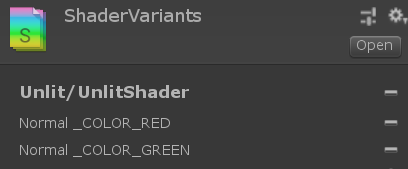
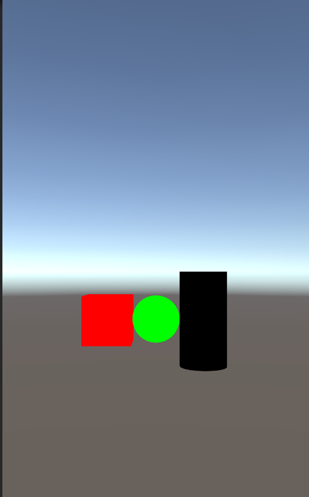

# Simple Sampleシリーズ`SimpleShaderVariantCollectionWithAssetBundleSample`
## 概要
ShaderVariantCollectionをAssetBundleで運用する場合の本当にシンプルなサンプルプロジェクトです。
AssetをAssetBundle化して運用する際に、Shaderの重複を抑える為に`ShaderValiantCollection`を使えば良いという所までは判ったがその先どうすれば良いか解らない人の道しるべとして見て頂きたいサンプルプロジェクトです。
可能な限りシンプルにする為、AssetBundleをStartの中で同期読みしている等、このましく無い部分がありますが、その辺りは気にしないでください。

## 動作確認環境
- Unity2018.4.17f1 + Windows Editor / Android

## プロジェクト説明
- プロジェクト内には共通のShaderを使用する[RedCube](Docs/image/b6faf2b8ca6b8ffdd21f606df9c81251.png)・[GreenSphere](Docs/image/508572e96327a52d20846db4ccd59c5c.png)・[BlueCylinder](052e2d3455fc7a292e06d23f8ab3bae4.png)の３種類のオブジェクトが存在しており、それぞれ個別にAssetBundle化されている。
- Shaderはリソースの重複化を避ける為に単体でAssetBundle化されている。
- Shaderには下記の用に`Keyword`が定義されている。
```
#pragma shader_feature _ _COLOR_RED _COLOR_GREEN _COLOR_BLUE
```
- ShaderがどのようなKeywordの組み合わせのValiantが有効であるか明示的に指定する為にShaderValiantCollectionを作成し、Shaderと同じAssetBundleに同梱している。
- ShaderValiantCollectionは下記のように設定している。
```
Unlit/UnlitShader
Normal _COLOR_RED
Normal _COLOR_GREEN
```
※ _COLOR_BULEのKeywordを明示的に含めていない。


プロジェクトに含まれる`Scenes\SampleScenes`では下記を実行する。
- 事前に共通Shader(及びShaderValiantCollection)を含むAssetBundleをロード(ロードのみで良い。Unloadせずロードしたままにしておく)
- Cube,Sphere,Cylinderオブジェクトを含むAssetBundleをそれぞれロードしてGameObjectをInstantiateを実行

### 実行結果
使用しているRed,Greenのバリアントが有効なCubeとSphereは指定した色でレンダリングされるが、Cylinderに関しては、黒で描画されている。<br>



